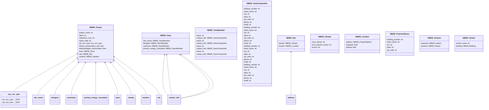

```mermaid
classDiagram
class NBDM_Project{
project_name: str
client: str
salesforce_num: str
report_date: str
nyc_ecc_year: nyc_ecc_year
historic_preservation_site: bool
disadvantaged_communities: bool
team: NBDM_Team
site: NBDM_Site
variants: NBDM_Variants
}
class nyc_ecc_year{
nyc_ecc_year : _2019
nyc_ecc_year : _2023
}
NBDM_Project <-- nyc_ecc_year
class NBDM_Team{
site_owner: NBDM_TeamMember
designer: NBDM_TeamMember
contractor: NBDM_TeamMember
primary_energy_consultant: NBDM_TeamMember
}
class NBDM_TeamMember{
name: str
contact_info: NBDM_TeamContactInfo
}
class NBDM_TeamContactInfo{
building_number: str
street_name: str
city: str
state: str
zip_code: str
phone: str
email: str
}
NBDM_Team <-- contact_info
NBDM_Project <-- site_owner
class NBDM_TeamMember{
name: str
contact_info: NBDM_TeamContactInfo
}
class NBDM_TeamContactInfo{
building_number: str
street_name: str
city: str
state: str
zip_code: str
phone: str
email: str
}
NBDM_Team <-- contact_info
NBDM_Project <-- designer
class NBDM_TeamMember{
name: str
contact_info: NBDM_TeamContactInfo
}
class NBDM_TeamContactInfo{
building_number: str
street_name: str
city: str
state: str
zip_code: str
phone: str
email: str
}
NBDM_Team <-- contact_info
NBDM_Project <-- contractor
class NBDM_TeamMember{
name: str
contact_info: NBDM_TeamContactInfo
}
class NBDM_TeamContactInfo{
building_number: str
street_name: str
city: str
state: str
zip_code: str
phone: str
email: str
}
NBDM_Team <-- contact_info
NBDM_Project <-- primary_energy_consultant
NBDM_Project <-- team
class NBDM_Site{
climate: NBDM_Climate
location: NBDM_Location
}
class NBDM_Climate{
zone_ashrae: str
zone_passive_house: str
source: str
}
NBDM_Project <-- climate
class NBDM_Location{
address: NBDM_ProjectAddress
longitude: float
latitude: float
}
class NBDM_ProjectAddress{
building_number: str
street_name: str
city: str
state: str
zip_code: str
}
NBDM_Site <-- address
NBDM_Project <-- location
NBDM_Project <-- site
class NBDM_Variants{
proposed: NBDM_Variant
baseline: NBDM_Variant
}
class NBDM_Variant{
variant_name: str
building: NBDM_Building
}
```
